# The Good Parts of JS - Douglas Crockford

### Glossary

- JS - JavaScript 
- PL - Programming Language

---

JS is now, unexpectedly, the most important programming language in the world.

In *Thinking Fast and Slow*, Kahneman explained that one of the fundamental assumptions of Economics doesn't hold, that is in any transaction a party can be expected to act in their own best interests. Except if you're human.

We *think* with two systems: 

- Head (system 2) - analytic, slow, computationally expensive
- Gut (system 1) - intuitive, heuristic, associative, fast, requires little effort, on all the time

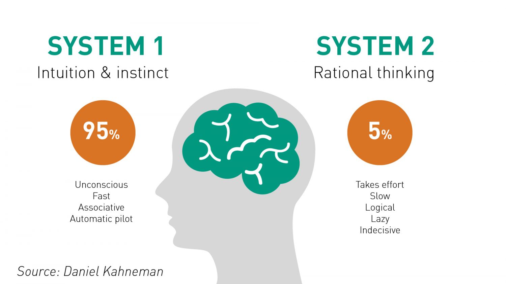

Oftentimes you can hear both of them working at the same time, e.g. when you need to make a difficult decision. 

---

Advertising has known how to bypass the brain and influence the gut for decades.

AI was supposed to be able to write its own software to solve problems. It hasn't done that yet. Because of that, we still write programs by hand and we need **Programming Languages**.

We can't write perfect programs. It would take too long, and we can't test them anyway. We can only test imperfection. Therefore we knowingly put software into production and patch as we go.

Our brains haven't evolved since the last Ice Age. We are still Hunter Gatherers. There's nothing in our evolution that primes us for programming. We use both systems (1, 2), but we don't know *how* we do it. 

---

JS has some of the best parts ever put into any programming language; JS also famously has more bad parts than ever other programming language. Ever language is like this. However, JS has a lot of extreme goodness and badness at each end!

**JSLint**, created by Douglas, tries to warn you about some of these bad parts. Warning! JSLint will hurt your feelings.

Tabs vs spaces, curly braces left or right, etc. Like driving a car on the left or right, it doesn't really matter (according to the data), it's just important that everyone is consistent!

e.g. In JS, we should put them on the right.

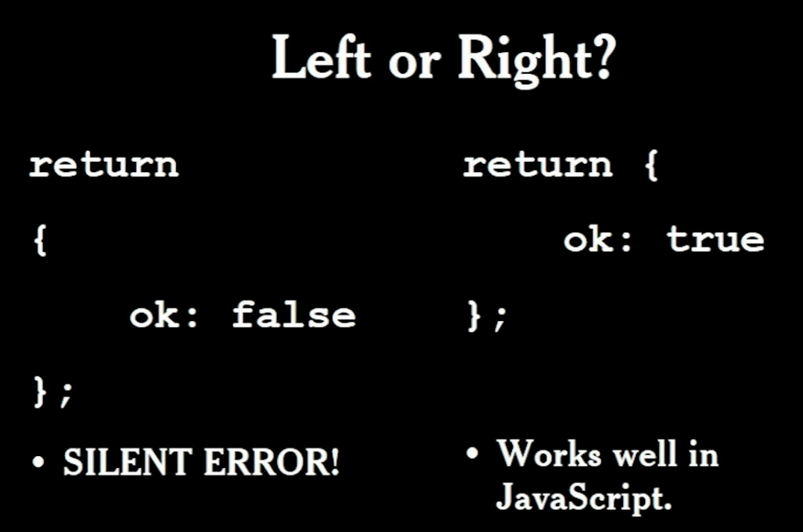

JS was designed as a language for beginners. But, it looks like C, which is hard to read.

**Prefer forms that are error resistant**

---

Although we've agreed that `Goto` is a bad idea, it survives in modern PLs in the `switch` statement: The fallthrough hazard.

"That hardly ever happens" is another way of saying "It happens".

A good style can help produce better programs. Style should not be about personal preference and self-expression.

"THEROMANSWROTELATINALLINUPPERCASEWITHNOWORDBREAKSORPUNCTUATION" and yup, that worked for them!

The introduction of Christianity brought the need for punctuation, upper/lower case, word breaks, etc. to cut the error rate in duplication. It also made manuscripts easier to read and were adopted by Gutenberg.

Programs must communicate clearly to people. 

---

**Use elements of good composition where applicable.** Where applicable = unless there is a clear trade-off for not doing so ... ?

- Never rely on automatic semicolon insertion, if not sure, use JSLint.

- Don't use the `with` statement. It's confusing. Confusion must be avoided!
- Always use `===` (checks type), never `==` (doesn't). `===` was invented after creator realised `==` was wrong.

**Avoid forms that are difficult to distinguish from common errors**

---

**Scope**

Block scope vs. function scope

Most PLs have block scope, JS has function scope.

==>

- Declare all variables at the top of the function
- Declare all functions before you call them

`let` respects block scope. Introduced in ES6. Eventually we'll all be using `let` over `var` 

https://www.w3schools.com/js/js_es6.asp

**Global variables**

- global variables are evil. Avoid them. They cause coupling and linkages which we try to avoid. That said, they're used in the Browser out of necessity.  
- if you do use them, write them `LIKE_THIS`
- global vars should be rare as hens teeth are stick out like a sore thumb

**Constructor functions should be named with InitialCaps** - because it requires a `new` prefix.

As processes become more 'agile', coding must be more resilient.

---

`++` operator used to be used for pointer arithmetic. Now we've determined that's a bad idea, yet we still use `++` to create cute one-liners. Code like this is hard to maintain.

`x ++` ==> `x += 1` is better.

---

**Performance**

- Performance specific code is usually crufty (overly-complex; poorly built; unpleasant).
- Clean code is easier to reason about.
- "Premature optimisation is the root of all evil" -- Donald Knuth
- Most code has negligible impact on performance. Only optimise that which is taking time.
- Algorithm replacement is vastly more effective than code fiddling.

---

Programming is the most complicated thing that humans do.

Computer programs must be perfect.

Humans are not good at perfect.

Designing a programming style demands discipline.

Less time spent in *The Abyss*, the better. That's why many who try programming shy away, they remember how unpleasant fixing code is! 

JSLint style was driven by the need to automatically detect defects.

Forms that can hide defects are considered defective.

If everyone follows a programming style, we improve inter-operability.

Bugs are inevitable. Your goals is to do what you can to write less of them.

---

Netscape wanted a language for their browser, Navigator. That produced **LiveScript**, inspired by Java, Scheme and Self (without classes).

**Origin of JavaScript:**

Sun wanted to be free from Microsoft, so they designed Java to target the Java Virtual Machine, rather than the OS.

Similarly, Netscape wanted to be free from Microsoft, so they wanted a language that targeted the Browser.

Nov 1995 - https://www.cnet.com/news/netscape-and-sun-unveil-javascript/

Sun dropped HotJava, a competing browser

But Netscape wouldn't let go of LiveScript because they wanted an language for beginners, so instead they changed its name to **JavaScript** and claimed it was sister language--which it is not.

Microsoft completely missed the Web, they had gambled on Fax and Cable TV, so in a rush they bought Spyglass (Internet Explorer) and after reverse engineering JS (and recording all its flaws) its own language **JScript**.

Netscape is worried, because Microsoft is going to extend JavaScript. They went to W3C in an attempt to create a standard. That failed, and they went to ECMA, and they said Yes, making use of all Microsoft has discovered when reverse engineering JS. This language was called... **ECMAScript** - **ES3, ES5, ES6** etc.

https://codeburst.io/javascript-wtf-is-es6-es8-es-2017-ecmascript-dca859e4821c

Where do Bad Parts come from?

- Legacy - things we got wrong a long time ago and still exist in several languages.
- Good Intentions - stuff we thought would make our lives easier, but didn't.
- Haste - created in 10days! Netscape shipped an experiment.

Fortunately, for the most part we can ignore the bad parts. The ones we can't are dangerous. 

---

JS is OO, but in JS an object `{}` is a dynamic collection of properties. This is a `dict` in Python, for example.

JS coerces keys to strings. 

Object literals are the inspiration for JSON - the world's most popular data exchange format.

Objects have inheritance:

```javascript
> var mother = {
... a: 1,
... b: 2
... };
undefined
> mother
{ a: 1, b: 2 }
> var daughter = Object.create(mother)
undefined
> daughter
{}
> daughter.b += 2;
4
> daughter
{ b: 4 }
> daughter.a += 1;
2
> daughter
{ b: 4, a: 2 }
> daughter.c = 9
9
> daughter
{ b: 4, a: 2, c: 9 }
```

---

Everything in JS is an **Object**.

Decimal fractions are approximate:

```javascript
> 0.1 + 0.2 === 0.3
false
```

Numbers have methods: `toExponential, toFixed, ...`

```javascript
> a = 0.1
0.1
> a.toExponential()
'1e-1'
```

Every number inherits from `Number.prototype`

We also have the `Math` object:

```javascript
> Math.sqrt(a)
0.31622776601683794
> Math.PI
3.141592653589793
```

**NaN** - confusing!

`typeof(NaN) === 'number'` is false

`NaN === NaN` is false

`NaN !== NaN` is true

`isNaN(NaN) is true`

---

**Why is String called String? **- No one really knows! Can't find an origin in the literature.

`""` and `''` are interchangeable, Douglas recommends:

- use `""` for external strings (urls, notes to user, etc.) 
- use `''` for internal strings (properties, character constants, etc.)

Strings have loads of methods.

https://frontendmasters.com/courses/good-parts-javascript-web/arrays/

---

**Arrays**

Array inherits from Object (pure array type doesn't exist)

Arrays have many methods

`.sort()`

```javascript
> var l = [8,15,4,23,42,1]
undefined
> l.sort()
[ 1, 15, 23, 4, 42, 8 ]
// oh, shit
```

^ it's sorting them as strings...

^^ You can override this default behaviour, but it's stupid by default.

`.splice()`

```javascript
[ 'a', 'b', 'c', 'd' ]
> delete m[1]
true
> m
[ 'a', <1 empty item>, 'c', 'd' ]
> m.length
4
//^ delete doesn't do what we expect it to
> m.splice(1,1)
[ <1 empty item> ]
> m
[ 'a', 'c', 'd' ]
```

**Arrays vs Objects**

- objects when names are arbitrary strings: `o['foo']`
- arrays when names are sequential integers: `a[0]` 

---

RegEx is hard to decipher. 

Use https://jex.im/regulex/ for assistance.

All values are objects, except `null` and `undefinied` -- so called bottom cases. 

In your own coding, use `undefined`. That's what JS uses by default. 

Use `Array.isArray()` to test type. `typeof(array) = object` :/ 

JS is loosely typed. 

Strong typing is a strong force at the moment. It finds errors at compile time that you can't find without it.

- TypeScript, etc.

But, "Type systems don't help you find the bugs that keep you up at night." **???**

And, you save a lot of time working against the type system!

^ DC is against strong typing in JS.

---

JS syntactically similar to C

`+` does both addition and concatenation. A bad idea in a loosely typed language. It can lead to bugs.

`+"42" = 42` - coerces str to number

---

`For` largely replaced by `map` and `ForEach`

---

All you need is Functions in JS. They make up a lot of the good parts!

A `function` produces an instance of a function object. Inherits from `Function.prototype`

Function objects are first class

- may be passed as an arg to a function
- may be returned from a function
- may be assigned to a variable
- may be stored in an object or array

**Scope**

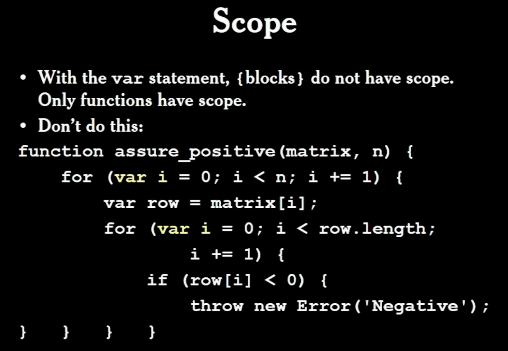

**This**

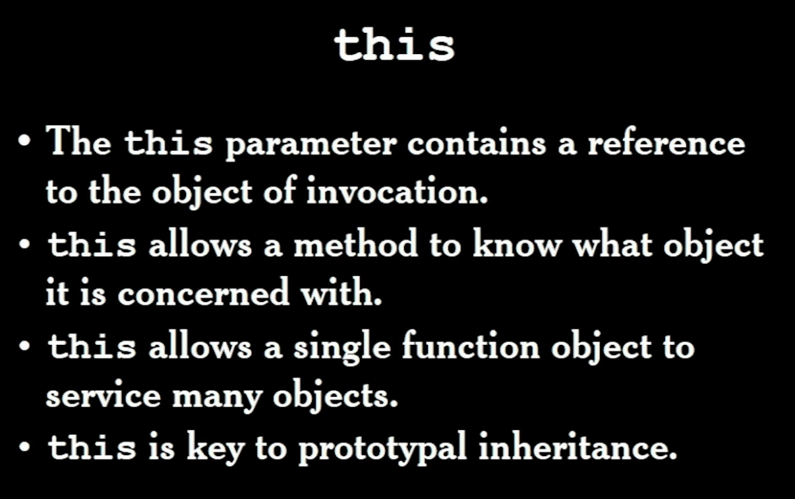

Recursion supported by JS

--> seen in quick sort

---

**Closure** aka Lexical Scoping/Static Scoping

- The context of an inner fn includes the scope of the outer fn
- An inner fn enjoys that context even after the parent functions have returned

Fn scope works like block scope:

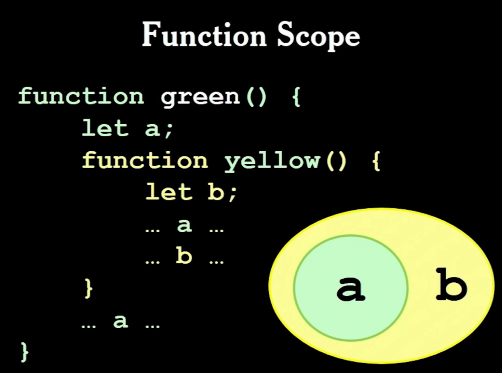

^ This is known as **closure**

We get over the problem of not having `a` when we want to call `yellow()` by "allocating memory to the *heap* instead of the the _stack_ and using a good garbage collector." -- First implemented in ... JS!

example:

 ```javascript
var digit_name = (function () {
	var names = ['zero', 'one', 'two', 'three',
				 'four', 'five', 'six','seven',
				 'eight', 'nine'];
	return function (n) {
		return names[n];
	}
}());
console.log(digit_name(7)) // 'seven'
 ```

https://frontendmasters.com/courses/good-parts-javascript-web/pseudoclassical-inheritance/

---

**Skipping section on Pseudoclassical Inheritance, Functional Inheritance, Constructors**

https://www.w3schools.com/js/js_object_constructors.asp

---

**Ajax - Asynchronous JS and XML** - https://www.youtube.com/watch?v=RDo3hBL1rfA

^ Instead of sending entire web pages when you need something back from the server, we send individual snippets of what we need with Ajax.

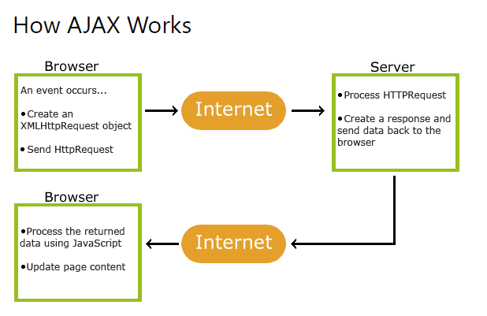

The web comes from typesetting and word processing.

Started with GML:

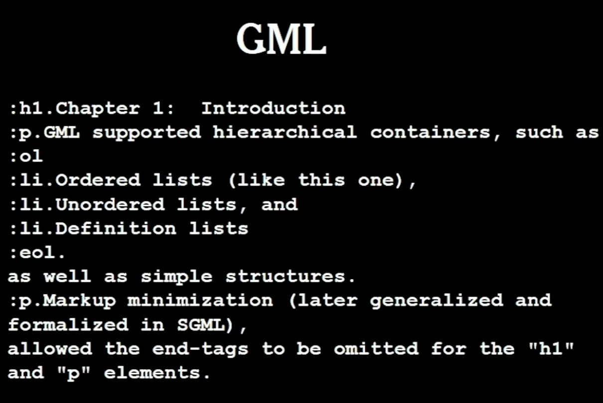

^ starting to look like ... html

Inspired by Scribe:

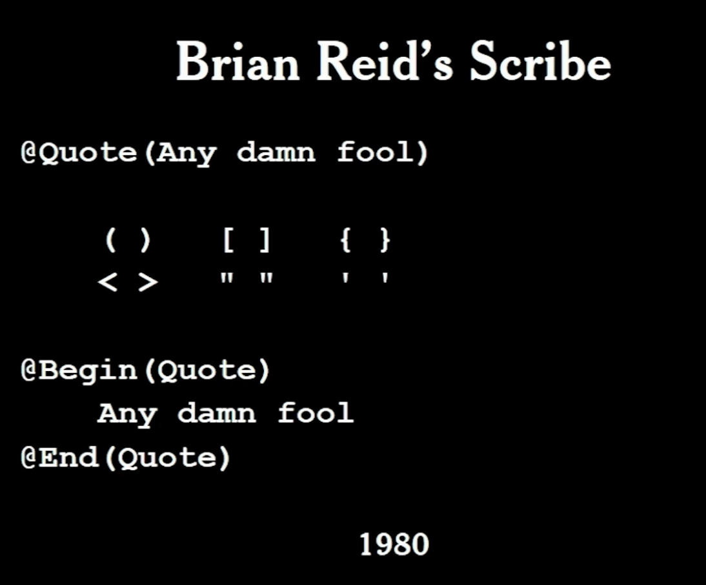

^ which brought us attributes 

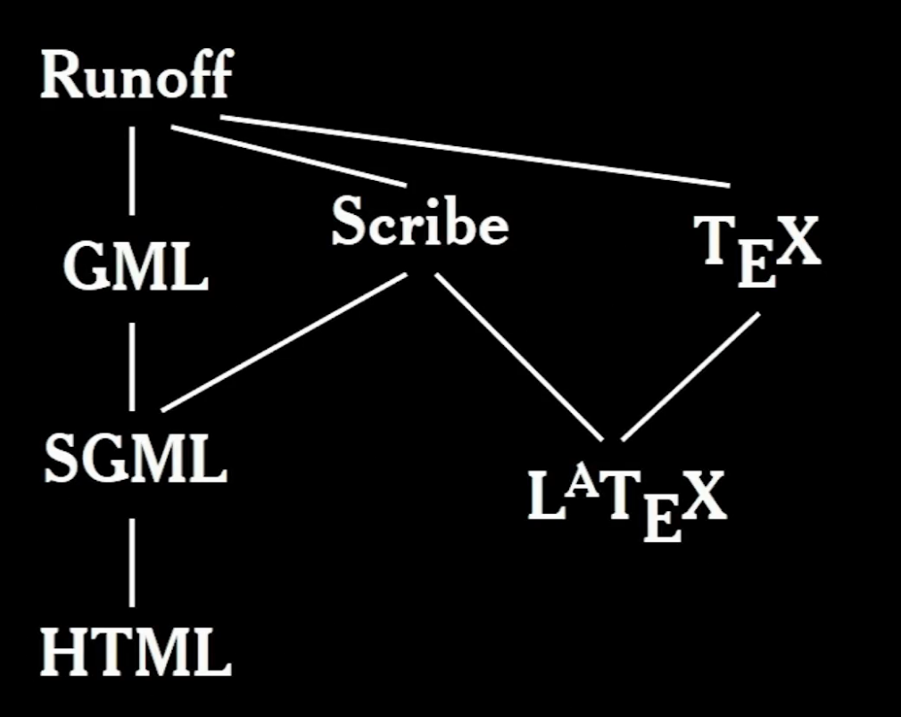

---

**HTML** was intended for document viewers originally. It wasn't well suited to the web. We used it anyway.

pros:

- huge improvement over SGML
- much simpler (usually good)
- more resilient - actually not good? - we heroically try to render what we can instead of failing entirely - this generated security conflicts

cons:

- can't predict final presentation on client 
- too limited - classitis and iditis
- it did not anticipate applications beyond simple document retrieval

HTML also has a mix of nested `<ol><li>` and not nested `<h1><h2>` forms.

A web page isn't a page... it's a scroll - we invented pages after scrolls!

**XML** was meant to replace HTML for web pages and it was meant to be an exchange language like JSON. It failed at both.

**CSS** - oh boy!

- Lack of modularity
- Selector management is complicated
- Declarations are too weak for modern web apps
- Not intended for dynamic content
- It is unimplementable. It's all about the quirks.

**The reason the web didn't die was because of ... JS!**

The **DOM** - "one of the worst APIs ever invented"

- It is what most people hate when they say they hate JS
- The browser's API

---

**The Browser**

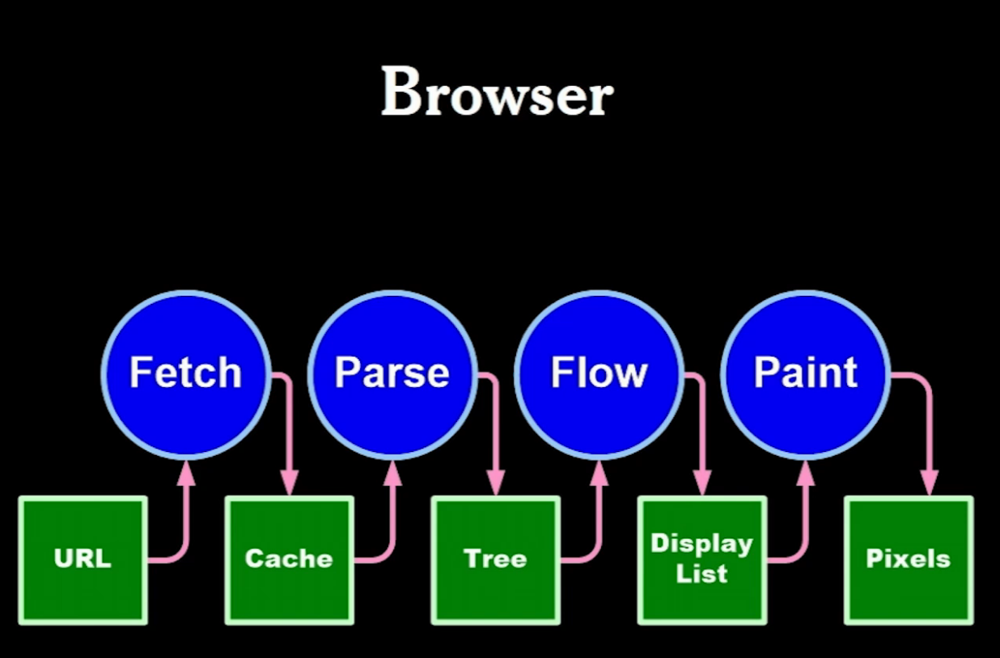

**Mosaic + Godzilla = Mozilla!**

Mozilla was better than Mosaic at handling images, so it became popular.

---

Where do you put JavaScript in a text format?

==> `<script></script> ` 

**document.write**

- allows JS to produce HTML text
- before onload - inserts HTML text into document
- after onload - uses HTML text to replace the current document
- not recommended! - used maliciously 

**`<script></script>`**

- place tags as close to the bottom of the body as possible. Also place css `<link>` as high in the head as possible
- minify and gzip script files
- reduce number of script files as much as possible

---

**Document Tree Structure**

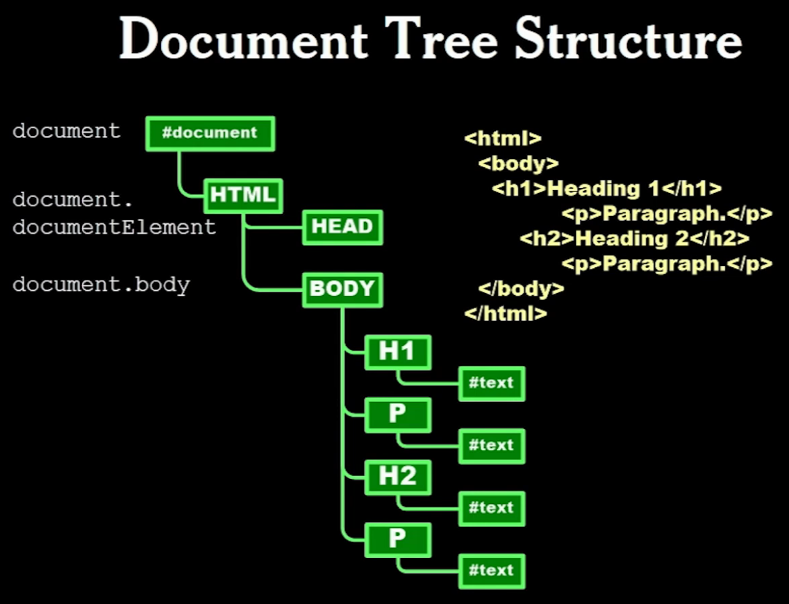

DOM still uses uppercase (old HTML convention)

`document` is a global variable in the browser

---

**Retrieving Nodes**

`document.getElementById(id)`

`document.getElementByName(name)`

`node.getElementsByTagName(tagName)`

Once you have access to a node you can manipulate it.

e.g. ``

- align, alt, border, height...

Browsers have additional properties specific to each browser. It's a trap. Stay away from them.

**Style Names**

CSS and DOM designed around the same time.

| CSS              | DOM             |
| ---------------- | --------------- |
| background-color | backgroundColor |
| border-radius    | borderRadius    |
| font-size        | fontSize        |
| list-style-type  | listStyleType   |

etc... 

CSS `-` minus signs are intepreted as `minus`, so that was a bad call. DOM could have helped out by replacing `-` with `_`, or something else. Instead they wrote properties in camelCase, making switching between CSS and DOM a pain.

Don't mess with the DOM, write good HTML. 

---

**Events**

- The browser has an event-driven, signle-threaded programming model
- Events are targeted to particular nodes
- Events cause the invocation of event handler functions

**Mouse Events**

The target is the topmost (z-index) node containing the cursor

- click, dblclick, mousedown, mousemove, etc.

**Input Events**

The target is the node having _focus_

- blur, change, focus, keydown, keypress, etc.

**Trickling & Bubbling**

Trickling - start from the top, stop when a node says "I can handle this". **Avoid this.**

Bubbling - start at the target, then move to its parent, and so on, until the event is cancelled. **Designed by Microsoft - the right way**

**WC3 decided to allow both ways**

---

**Performance**

In most applications, JS has a small cost. Everything else: touching a node; styling; reflow; repaint; and random things like nodelist can have a big cost.

**Performance Tools**

- Speed Tracer for Chrome

---

A small amount of JS makes the DOM (one of the world's worst APIs) into something pleasant and productive. 

JS libs:

- Portability (browsers are inconsistent)
- Error correction
- Model
- Widget

**Any library is better than the DOM** 

Ajax, JQuery, etc...

---

**Division of Labour**

How to split the work between the server and the client?

Originally, servers were king, browser is a terminal - too much demand on server

Then, swung to client doing everything - too slow to send over the web (?)

Solution: Seek the Middle Way

- A pleasant dialogue between specialised peers
- Minimise the volume of traffic

---

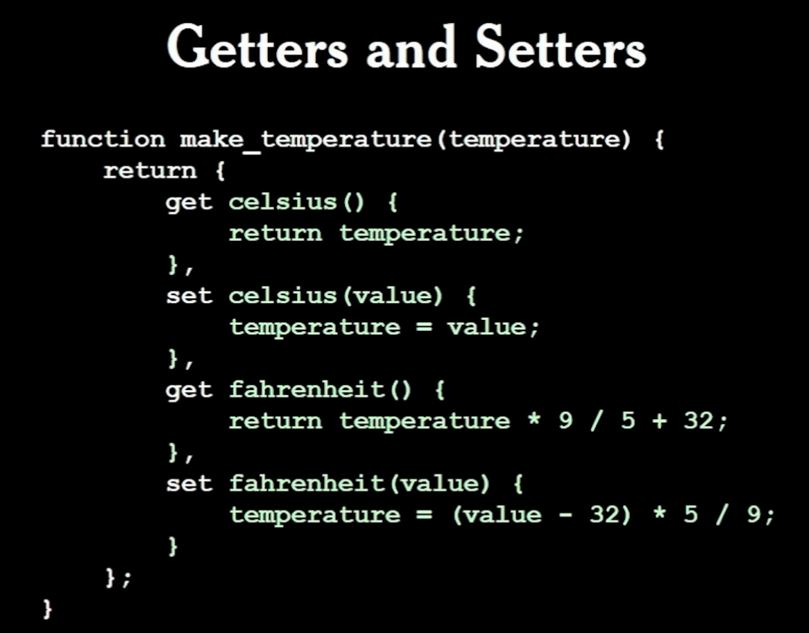

---

JS is open (exposed) because its creator expected people down the line would need to patch it ==> poly-filling, monkey-patching.

---

**skipped meta-object API**

---

**Strict Mode**

Introduced in ES5

1. Eliminates some JavaScript silent errors by changing them to throw errors.
2. Fixes mistakes that make it difficult for JavaScript engines to perform optimizations: strict mode code can sometimes be made to run faster than identical code that's not strict mode.
3. Prohibits some syntax likely to be defined in future versions of ECMAScript.

---

**skipped coding challenge section**

---

**The History of Security**

*White hats vs black hats*

Security is not about hats

Security is everyone's job. Don't leave it to specialists.

Security is a massive topic. Too much to cover if you have a day job.

Deterrence is not effective - you can't punish an invisible attacker. Prevention is the only effective mechanism.

---

**Auguste Kerckhoffs**

_La Cryptographie Militaire 1883_ - first modern book on cryptography 

**Kerckhoffs Principle: The design of a system should not require secrecy; and compromise of the system should not inconvenience the correspondents.**

e.g. 

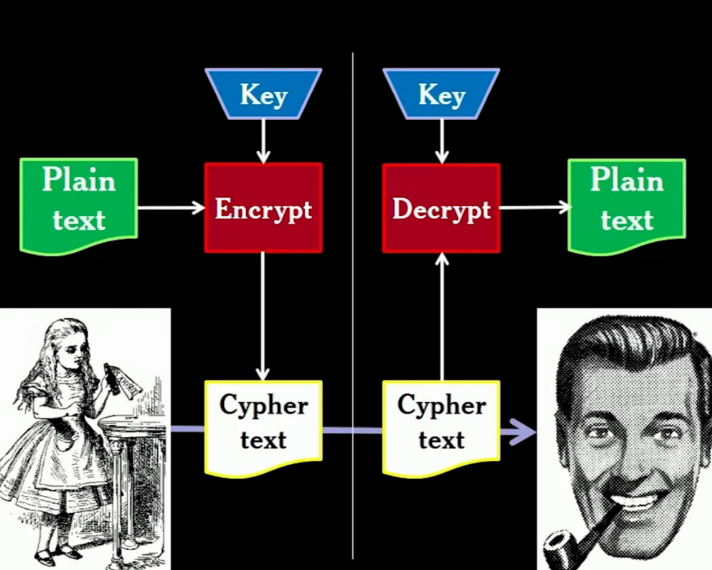

There are no 'secrets' designed into this encryption machine. The only secret is the key.

The machine is Open. Everyone can see how it works. 

There is no security in obscurity.

Just worry about keeping the 'keys' safe, which is hard enough!

---

One Time Pad - the only truly unbreakable (unbruteforceable) system

- the key must always remain secret
- the key must be at least as long as long as the plain text
- the cypher text is obtained by `XOR` of the plain text and the key
- the key must be perfectly random - cryptographically random 

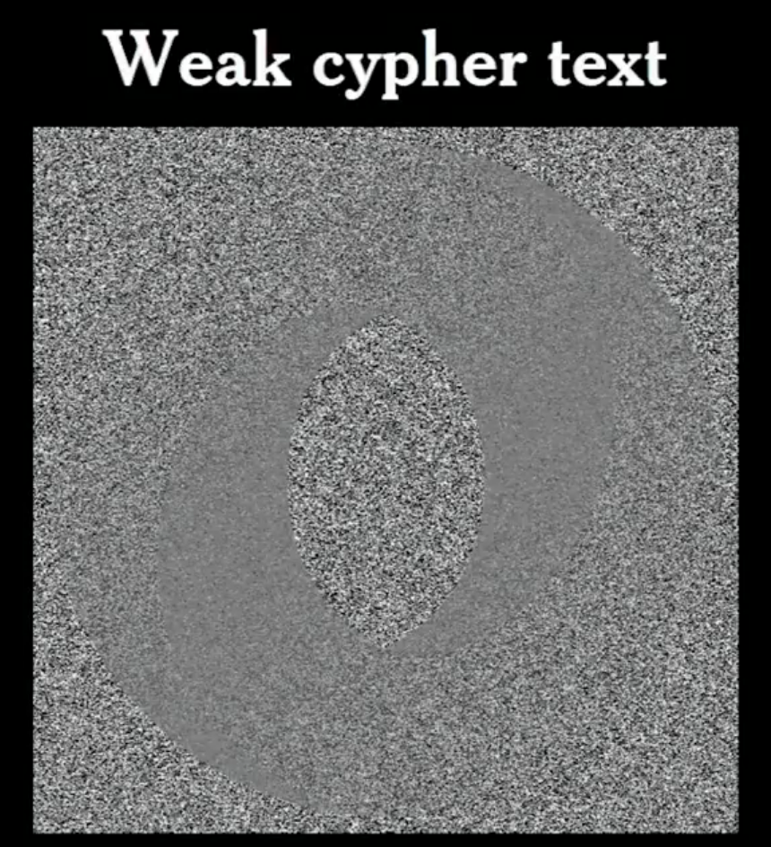

^ the original logo leaks through the key

- A key must never be used more than once

**Cryptography is not security** 

Characters we like to use in thinking about cryptography: 

- Alice & Bob
- Eve - Eavesdropper (packet sniffing, etc.)
- Mallory - Man In The Middle (giving your credentials to fake server)
- Satan - Totally malicious. Very rich, smart and determined. Blacklisting doesn't work - you create a new ID. Whitelist doesn't work either. Solution?  Accept Satan will connect and will do whatever we allow him to do to us and our customers. Therefore we have the responsibility to do everything right, so that Satan's capabilities are limited so he can't cause harm.

**Therefore: Security must be factored into every decision**

Red flag : "We'll go back and make it secure later" - Security is hard to retrofit

---

**Security and the Browser**

- horribly insecure
- still "fixing it later"
- HTML5 made it worse instead of better

Yet it is still better than everything else.

the Web does not blame the victim - :heavy_check_mark:

The browser represents a site, not the user. :heavy_check_mark:

What the web got wrong:

- There can be more interests involved than the user's and the site's
- A malicious party can exploit coding conventions t inject malicious code - that malicious code gets all the rights of the site
- This is known as the XSS problem

Once a script gets in, it can request additional scripts from any server in the world. Browsers protect against this by restricting the origin of scripts.

Your server cannot detect that the request did not originate with your app.

If your server accepts SQL, they can access your DB.

An attacker has control over the display and can request information from the user - phishing attacks

Sites block this by requesting your password when dangerous stuff is going on - except when the attacker can ask YOU for your password first

The Origin Policy is one way. The Attacker can send data to wherever.

^

The browser does not prevent any of these.

Web standards require these weaknesses.

---

^ This is called **XSS** (CSS was taken)

Suggests there's something wrong with **Cross Side Scripting**, but that's wrong! We want sites to communicate with each other.

Also, you don't need a second site to do XSS, so the name is just wrong.

Invented in 1995 since JS was released. 

**A mashup** is a self-inflicted XSS attack.

Advertising is a mashup.

"The most reliable, cost effect method to inject evil code is to buy an ad."

Why is there XSS?

- The web stack is too complicated - too many languages - each can be nested inside of each other 
- browsers do heroic things to make sense of malformed content
- Template-based web frameworks are optimised for XSS injection
- JS global objects give every scrap of script the same set of powerful capabilities

As bad as it is at security, the browser is a vast improvement over everything else.

The browser didn't anticipate interests other than the user and the site:

- an ad or a widget or an Ajax library gets the same rights as the site's own scripts

JS got close to getting it right - it can be fixed some more

HTML - no hope

^ Therefore, this isn't going to be fixed easily

It's up to devs to create secure applications on an insecure platform

---

The Principle of Least Authority: Any unit of software should be given just the *capabilities* it needs to do its work, and no more.

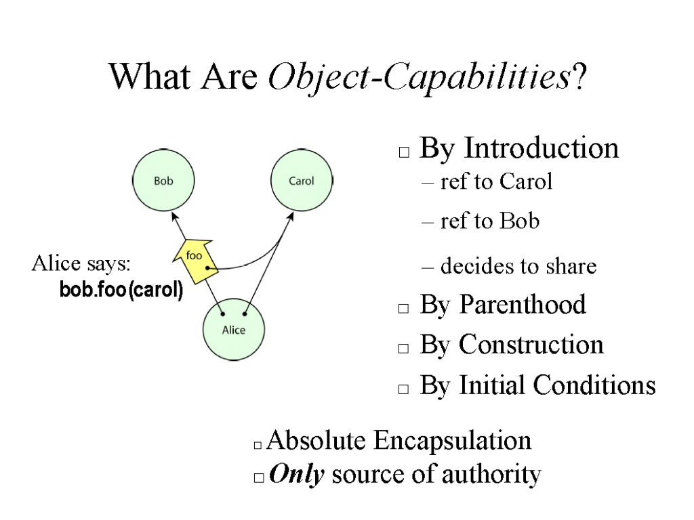

^ Corrupting a single object results in a corrupted object, not a corrupted system

[The Lazy Programmer's Guide to Secure Computing - Marc Stiegler](https://www.youtube.com/watch?v=eL5o4PFuxTY)

Confusion aids the enemy. Bugs are a manifestation of confusion. We think the system works one way, but the attacker knows how it actually works. This is why we ship bugs to production all the time.

With great complexity comes great confusion. Keep it simple. Keep it clean.

**Code Well**

- Good code is ultimately cheaper to produce than bad code, so might as well always write good code.
- Good code is easier to reason about.
- Code that is difficult to reason about it more likely to be problematic.
- Strict conformance to good style rules.
- Use a Linter 

---

**A Simple Attack**

user clicks on: `http://yoursite.com/<script>...</script>`

```html
<html>
    <body>
        <p>404 File not found:
            <script>...</script>
            //I can now run, thanks!
            //give me your password, etc.
        </p>
    </body>
</html>
```

- the script runs with the authority of your site
- the script gets cookies, local storage, everything

---

https://frontendmasters.com/courses/good-parts-javascript-web/synchronous-functions/


